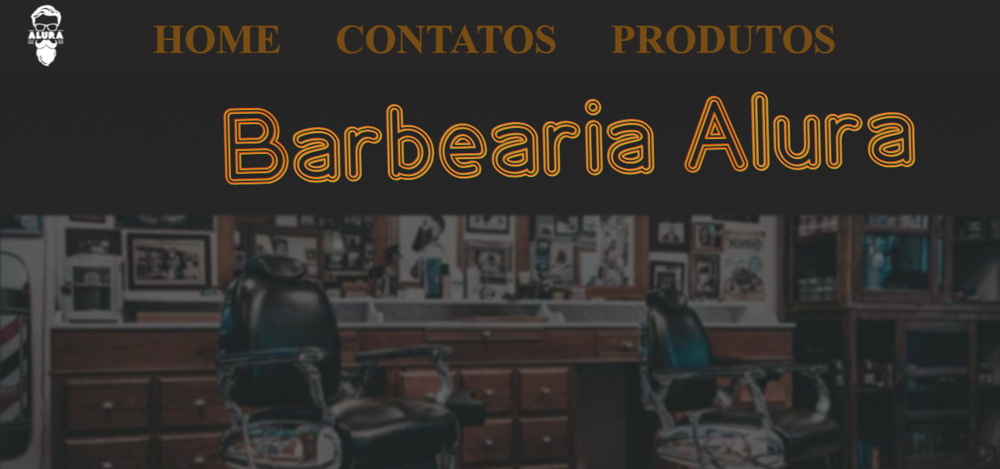
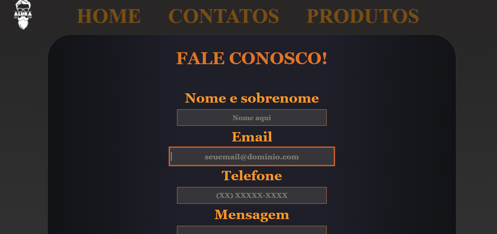
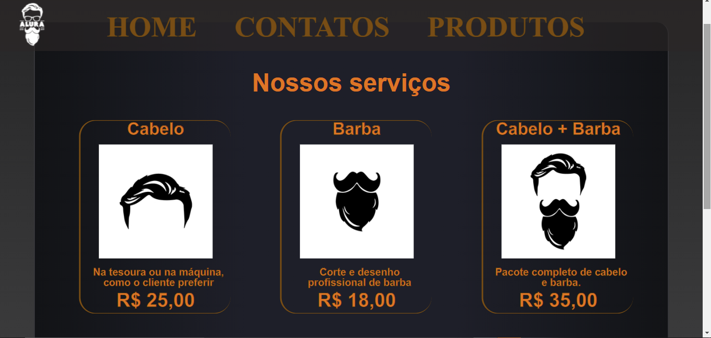

# Alura-Barbearia

Site Curso da Alura - HTML 

<!--
  adicionando imagens que ficam uma do lado da outra e tem tamanho controlável!
 utilizando 49% de espaço porque o github adiciona um margin próprio que acaba causando problemas pelo visto
-->
  

 
 

[Check it here!](https://emilymarquessalum.github.io/alura-barbearia/)

## Relacionados

 [Link Docs Para Conteúdo](https://docs.google.com/document/d/15aEcVLfdDfoKa_wCJQsRasfXziqRMN9UHO1MjB-O3ho/edit?usp=sharing)

## Estado
-- Terminado --

## Externals

- [clipboard.js](https://clipboardjs.com/)

## Folder Structure
A estrutura dos arquivos desse projeto é bem simples. As pastas principais são: 
- styles: arquivos .css
- behaviour: arquivos .js
- res: recursos (imagens e afins) 

##  Structure  Folder --not the same as previous one--

 Dentro da pasta structure, podemos encontrar os arquivos nav.js e footer.js, com seus respectivos .css. Eles servem, juntos, para que possamos adicionar um header e footer para qualquer página e poder modificar o conteúdo.
  
Aprendi essa técnica faz mais ou menos um ano, quando numa situação parecida com essa, onde tendo que utilizar apenas js, html e css.

A primeira vez, utilizei algo similar ao que temos [aqui](https://www.w3schools.com/howto/howto_html_include.asp)

O jeito que usei atualmente, que foi mais fácil, peguei [daqui!](https://stackoverflow.com/questions/18712338/make-header-and-footer-files-to-be-included-in-multiple-html-pages/29858653) (from new answer made in Dec 26 '21 at 16:35)

### Como usar?
Para utilizar, primeiramente é necessário marcar um elemento como sendo a nav ou o footer, com um id "app-nav" ou "app-footer", Isso vai indicar onde os componentes serão adicionados. Depois, é necessário importar os 4 arquivos js e css.
 
