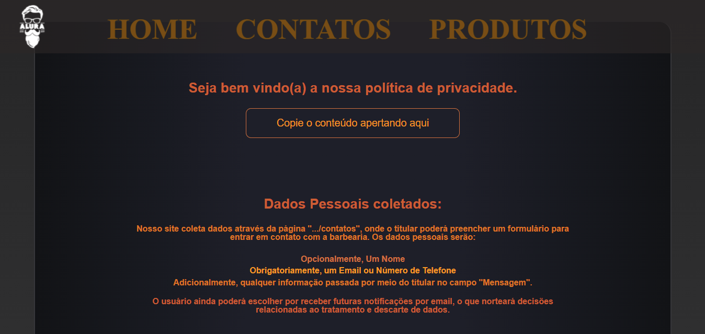

# Alura-Barbearia

Site Curso da Alura - HTML 

<!--
  adicionando imagens que ficam uma do lado da outra e tem tamanho controlável!
 utilizando 49% de espaço porque o github adiciona um margin próprio que acaba causando problemas pelo visto
-->
  

 
 

[Check here!](https://emilymarquessalum.github.io/alura-barbearia/)
 

 [READ ME - portugues](readmeres/README-br.md)
 [READ ME - english](readmeres/README-en.md)

 
 
